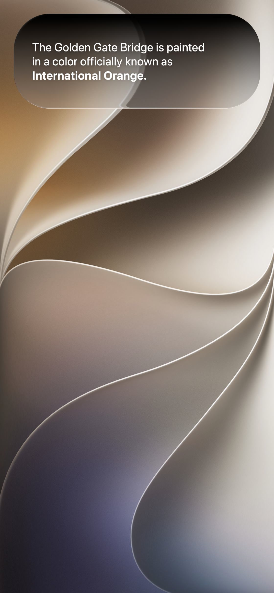

# Liquid Glass

A configurable liquid-glass material implemented for **WebGL** and
**Android Jetpack Compose**. Both implementations share the same optical
recipe and expose reusable APIs instead of coupling the effect to the demo UI.

## Demo

[](web/demo/index.html)

Click the preview to open the self-contained Web demo, or
[watch the recorded demo (MP4, 7 seconds)](docs/video.mp4).

## Repository layout

```text
liquid-glass/
├── spec/material.md  # Shared material recipe and constants
├── web/
│   ├── src/           # Reusable WebGL renderer
│   └── demo/          # Self-contained interactive demo
└── android/
    ├── liquidglass/   # Reusable Compose library module
    └── app/           # Android demo app
```

## Web demo

`web/demo/index.html` is a single self-contained demo. You can double-click it
or serve it locally:

```sh
cd web
npm run build
npm run demo
```

Then open <http://localhost:8747/demo/>.

## Web API

```js
import { LiquidGlass } from "./web/src/index.js";

const glass = new LiquidGlass(canvas, { cornerRadius: 36 });
glass.resize(width, height, window.devicePixelRatio);
glass.setBackground(image);
glass.setLens(width / 2, 100, width * 0.9, 160);
glass.render();
```

The renderer requires WebGL 1 and the `OES_standard_derivatives` extension.
Set `glass.dynamic = true` when the background is a video or an animated
canvas, and call `render()` from the host animation loop.

The npm package metadata is prepared under `web/`, but the package has not yet
been published.

## Android API

Open `android/` in Android Studio, or build the demo from the command line:

```sh
cd android
./gradlew :app:assembleDebug
```

Capture the background once, then place one or more glass elements above it:

```kotlin
val backdrop = rememberLiquidGlassBackdrop()

Box {
    Box(Modifier.liquidGlassBackdrop(backdrop)) {
        BackgroundContent()
    }

    LiquidGlass(
        backdrop = backdrop,
        modifier = Modifier.size(width = 320.dp, height = 96.dp),
        style = LiquidGlassStyle()
    ) {
        ForegroundContent()
    }
}
```

Android rendering degrades by platform capability:

| Version | Rendering path |
| --- | --- |
| API 33+ | Full refraction, dispersion, blur, tone and highlights |
| API 31–32 | Native backdrop blur with a surface approximation |
| API 24–30 | Translucent surface fallback |

The Android module is source-only in this repository and has not yet been
published to Maven Central or JitPack.

## Verification

```sh
cd web && npm run build && npm pack --dry-run
cd ../android && ./gradlew \
  :liquidglass:lintRelease \
  :liquidglass:assembleRelease \
  :app:testDebugUnitTest
```

## Design reference

[Kyant0/AndroidLiquidGlass](https://github.com/Kyant0/AndroidLiquidGlass)
informed the Android library structure: a shared backdrop, modifier-based API,
capability-based fallbacks, and a demo kept outside the library module.

## License

The source code is available under the [MIT License](LICENSE).
